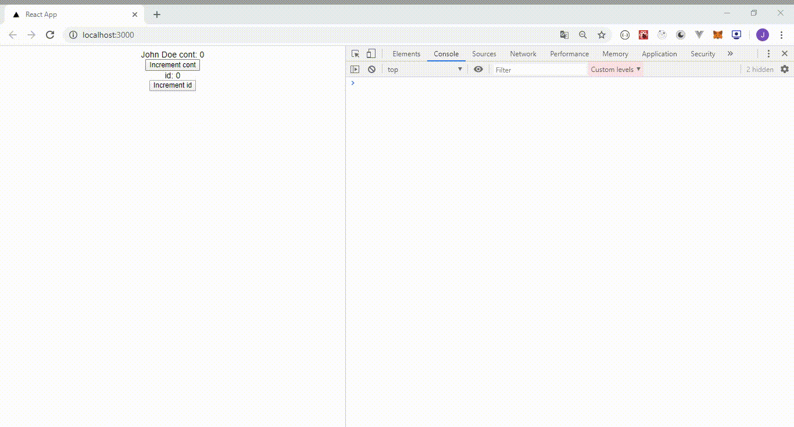
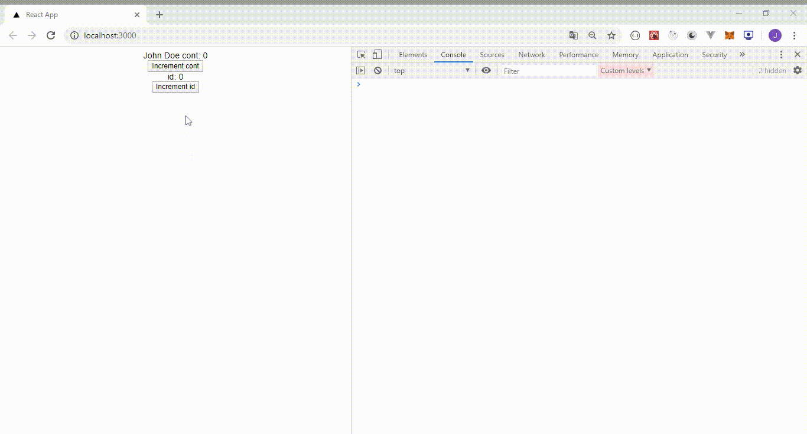

[](https://lemoncode.net/) 


[](https://github.com/Lemoncode/react-hooks-by-example/blob/master/18-why-did-you-update/Readme_es.md)
[](https://github.com/Lemoncode/react-hooks-by-example/blob/master/18-why-did-you-update/Readme.md)
  
<br>
<br>
  


# 18 Why Did You Update

Tal y como hemos visto en ejemplos anteriores, usando el componente de orden superior _React.memo_ evitamos renderizar un componente cuando las mismas props dan el mismo resultado. Pero, ¿Y si todavía ves renderizados que parecen innecesarios? Puedes usar un custom hook que te permite ver que props están causando que el componente se vuelva a renderizar. En este ejemplo aprenderemos como implementarlo.

# Pasos

- Tomaremos como punto de partida el ejemplo anterior [_17-use-debug-value_](https://github.com/Lemoncode/react-hooks-by-example/blob/master/17-use-debug-value). Copia el contenido del proyecto a una carpeta nueva y ejecuta _npm install_.

```bash
npm install
```

- Abramos el fichero _demo.tsx_. Crearemos un componente padre y no hijo. El componente hijo sólo mostrará sus props mientras que el componente padre tiene dos variables de estado mostradas y dos botones (estos botones incrementan el valor de las variables);

_./src/demo.tsx_

```tsx
import React from "react";

export const MyComponent = () => {
  const [cont, setCont] = React.useState(0);
  const [id, setId] = React.useState(0);

  const name = {
    firstname: "John",
    lastname: "Doe",
  };

  return (
    <div>
      <div>
        <MyChildComponent name={name} cont={cont} />
        <button onClick={() => setCont(cont + 1)}>Increment cont</button>
      </div>

      <div>
        <div>id: {id}</div>
        <button onClick={() => setId(id + 1)}>Increment id</button>
      </div>
    </div>
  );
};

interface Name {
  firstname: string;
  lastname: string;
}

interface Props {
  name: Name;
  cont: number;
}

export const MyChildComponent: React.FC<Props> = React.memo((props) => {
  return (
    <div>
      {props.name.firstname} {props.name.lastname} cont: {props.cont}
    </div>
  );
});
```

- Ahora tenemos que añadir nuestro custom hook _useWhyDidYouUpdate_ y usarlo dentro de _MyChildComponent_. Este hook recibe las props de un componente y comprueba si han cambiado.

_./src/demo.tsx_

```diff
import React from "react";

export const MyComponent = () => {
  const [cont, setCont] = React.useState(0);
  const [id, setId] = React.useState(0);

  const name = {
    firstname: 'John',
    lastname: 'Doe',
  };

  return(
    <div>
      <div>
        <MyChildComponent name={name} cont={cont} />
        <button onClick={() => setCont(cont + 1)}>Increment cont</button>
      </div>

      <div>
        <div>id: {id}</div>
        <button onClick={() => setId(id + 1)}>Increment id</button>
      </div>
    </div>
  );
};

export const MyChildComponent = React.memo(props => {
+ useWhyDidYouUpdate('MyChildComponent', props);
  return(
    <div>
      {props.name.firstname} {props.name.lastname} cont: {props.cont}
    </div>
  );
});

+// Hook
+function useWhyDidYouUpdate(name, props) {
+  // Get a mutable ref object where we can store props ...
+  // ... for comparison next time this hook runs.
+  const previousProps = React.useRef();
+
+ React.useEffect(() => {
+    if (previousProps.current) {
+      console.log(previousProps.current);
+      // Get all keys from previous and current props
+      const allKeys = Object.keys({
+        ...(previousProps.current as any),
+        ...props,
+      });
+
+      // Use this object to keep track of changed props
+      const changesObj = {};
+      // Iterate through keys
+      allKeys.forEach((key) => {
+        // If previous is different from current
+        if (
+          previousProps &&
+          previousProps.current &&
+          previousProps.current[key] !== props[key]
+        ) {
+          // Add to changesObj
+          changesObj[key] = {
+            from: previousProps.current[key],
+            to: props[key],
+          };
+        }
+      });
+
+      // If changesObj not empty then output to console
+      if (Object.keys(changesObj).length) {
+        console.log("[why-did-you-update]", name, changesObj);
+      }
+    }
+
+    // Finally update previousProps with current props for next hook call
+    previousProps.current = props;
+  });
+}
```

- Arranca el ejemplo para probar el hook.

```bash
npm start
```

- Si abres la consola del navegador, podrás ver que nuestro custom hook lanza un mensaje siempre que se hace click en el botón _Increment cont_. Esto es lo esperado, pero cuando el botón _Increment id_ se pulsa nuestro hook también muestra un mensaje en el console log. ¿Por qué? Porque la variable _name_ está dentro de _MyComponent_ y este componente se vuelve a renderizar cada vez que el usuario pulsa el botón _Increment id_. Este botón actualiza la variable de estado _id_ y siempre que el estado de un componente se actualiza, este se vuelve a renderizar (generando una nueva variable _name_).



- Gracias a nuestro custom hook nos hemos dado cuenta que la variable _name_ debería estar fuera de _MyComponent_. Si modificamos _demo.tsx_ poniendo la variable _name_ fuera del componente padre, el hook _useWhyDidYouUpdate_ sólo lanzará un mensaje en el console log cuando el botón _Increment cont_ se pulse.

_./src/demo.tsx_

```diff
import React from "react";

+ const name = {
+   firstname: 'John',
+   lastname: 'Doe',
+ };

export const MyComponent = () => {
  const [cont, setCont] = React.useState(0);
  const [id, setId] = React.useState(0);

- const name = {
-   firstname: 'John',
-   lastname: 'Doe',
- };
-
  return(
    <div>
      <div>
        <MyChildComponent name={name} cont={cont} />
        <button onClick={() => setCont(cont + 1)}>Increment cont</button>
      </div>

      <div>
        <div>id: {id}</div>
        <button onClick={() => setId(id + 1)}>Increment id</button>
      </div>
    </div>
  );
};

interface Name {
  firstname: string;
  lastname: string;
}

interface Props {
  name: Name;
  cont: number;
}

export const MyChildComponent = React.memo(props => {
  useWhyDidYouUpdate('MyChildComponent', props);
  return(
    <div>
      {props.name.firstname} {props.name.lastname} cont: {props.cont}
    </div>
  );
});
```



# ¿Te apuntas a nuestro máster?

Si te ha gustado este ejemplo y tienes ganas de aprender Front End
guiado por un grupo de profesionales ¿Por qué no te apuntas a
nuestro [Máster Front End Online Lemoncode](https://lemoncode.net/master-frontend#inicio-banner)? Tenemos tanto edición de convocatoria
con clases en vivo, como edición continua con mentorización, para
que puedas ir a tu ritmo y aprender mucho.

Si lo que te gusta es el mundo del _backend_ también puedes apuntante a nuestro [Bootcamp backend Online Lemoncode](https://lemoncode.net/bootcamp-backend#bootcamp-backend/inicio)

Y si tienes ganas de meterte una zambullida en el mundo _devops_
apuntate nuestro [Bootcamp devops online Lemoncode](https://lemoncode.net/bootcamp-devops#bootcamp-devops/inicio)
